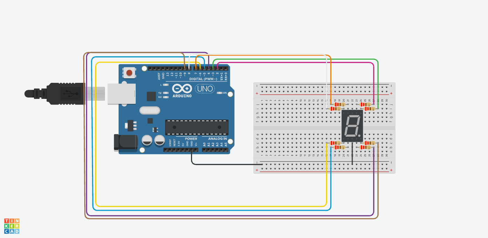

# 🔌 Embedded Systems & IoT (Arduino & Tinkercad)

This folder centralizes Arduino C++ projects, hardware simulations, and circuit designs developed during the Embedded Systems and IoT coursework at ETEC, focusing on microcontroller programming, sensors, actuators, and digital logic.

## 📂 Projects & Hardware Descriptions

- **[vetor1.ino](./vetor1.ino)**: 7-Segment Display Counter using Arrays[cite: 23, 24].
  - *What it does*: Controls a 7-segment display using an Arduino Uno and one-dimensional arrays to render and cycle through numeric patterns sequentially[cite: 23, 24].
  - *Tools & Elements Used*: Arduino Uno, breadboard, 7-segment display, protective resistors, `for` loops, binary arrays, and dynamic functions (`digitalWrite`)[cite: 23, 24].
  - *Circuit Schematic*: 

*(You can easily add your upcoming Arduino projects here following this same clean structure!)*

---
> *"We are born of the blood, made men by the blood, undone by the blood."*
